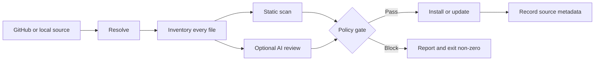

<div align="center">

<picture>
  <source media="(prefers-color-scheme: dark)" srcset="https://raw.githubusercontent.com/mazen160/skills-manager/main/assets/logo/logo-on-dark.png">
  
</picture>

<br><br>


<br>

**Scan skills before your agent trusts it.**

Manage skills for Claude, Cursor, Codex, and OpenCode. Skills Manager scans every install and update.

<a href="https://pypi.org/project/agentic-skills-manager/"></a>
<a href="https://github.com/mazen160/skills-manager/actions/workflows/ci.yml"></a>
<a href="https://github.com/mazen160/skills-manager/stargazers"></a>

<a href="https://github.com/mazen160/skills-manager/blob/main/LICENSE"></a>


[Why](#why-i-built-it) · [Scanner](#what-the-scanner-reads) · [AI review](#ai-review-is-a-second-opinion) · [Commands](#what-it-does) · [Install](#install-and-try-it) · [Reference](#reference)

</div>

---

## Why I built it

An agent skill can steer tool calls, run shell commands, and read files available to your agent. Installing one means trusting more than `SKILL.md`. Setup scripts, hidden files, hooks, archives, and binaries elsewhere in the source matter too.

I built Skills Manager because most skill installation workflows copy a repository directly into an agent's trusted directory. That is too much trust for code that can change how the agent behaves.

Skills Manager checks the selected GitHub repository or local folder before it copies anything. Static findings decide whether the operation can continue. If the skill passes, Skills Manager records its source so the same checks can run again before an update.

## What the scanner reads

The scanner does not stop at `SKILL.md`. It walks the selected source tree and checks:

- Private keys and credential-like values
- Shell execution, subprocess use, destructive commands, and network scripts
- Symlinks, hard links, path traversal, and unsafe archive contents
- Git hooks, package lifecycle scripts, registry rewrites, and native loading
- Hidden configuration, binaries, oversized files, and common scanner-evasion techniques

The scanner reads untrusted source. It does not execute bundled skill code.



## See it block an unsafe skill

The demo source includes a private key, a network download piped into a shell, a destructive command, and a hidden credential file. The scan identifies the exact files and stops before copying the skill:

<div align="center">


</div>

```text
Security result: unsafe (critical)
[CRITICAL] .env: Private key material found.
[HIGH] setup.sh: Network script piped into a shell.
[HIGH] setup.sh: Destructive 'rm -rf' command found.
exit code: 1
```

## AI review is a second opinion

Static checks run every time. Add `--ai-checks` when you also want Claude, Cursor, Codex, or OpenCode to review the source for intent that pattern matching cannot settle:

```bash
skills scan https://github.com/owner/repo \
  --ai-checks --ai-agent codex
```

The selected agent's findings join the report, but its verdict cannot clear a static block. By default, a blocked static scan skips AI review. `--force-run-ai-checks` runs it anyway while keeping the source blocked.

The four agent CLIs do not provide the same isolation. Read the [security policy](https://github.com/mazen160/skills-manager/blob/main/SECURITY.md) before reviewing untrusted source on a workstation with sensitive files or credentials.

## What it does

| Command | What it does |
| --- | --- |
| `scan` | Reviews a GitHub or local source without installing it. |
| `install` | Scans the source, applies the severity policy, and copies approved skills atomically. |
| `list` | Shows installed skills across Claude, Cursor, Codex, and OpenCode. |
| `update` | Fetches the tracked source, compares it with the installed copy, scans it again, and optionally applies the update. |
| `analyze` | Reports file counts, size, validation problems, broken links, and estimated context use for each skill. |
| `uninstall` | Previews and removes an installed skill. |

`scan` and `analyze` also have CI modes with JSON verdicts and non-zero policy exits.

## Install and try it

```bash
pip install agentic-skills-manager

skills scan https://github.com/owner/repo
skills install https://github.com/owner/repo
skills list --verbose
```

`install` scans the source again before copying it. For an isolated CLI environment, use `pipx install agentic-skills-manager` instead.

The package installs six command names: `skill`, `skills`, `skill-manager`, `skills-manager`, `agentic-skill-manager`, and `agentic-skills-manager`. They all run the same entry point. This README uses `skills`.

<details>
<summary><b>Requirements and running from source</b></summary>

You need Python 3.9 or later. GitHub sources also need `git` on `PATH`. AI review needs the selected local agent CLI: `claude`, `cursor`, `codex`, or `opencode`.

The production module has no third-party Python dependencies. You can run it without installing the package:

```bash
curl -O https://raw.githubusercontent.com/mazen160/skills-manager/main/skills_manager.py
python3 skills_manager.py --help
```

</details>

Run `skills` with no arguments to print the banner and command list.

<div align="center">


</div>

## Common workflows

### Work with local, single-file, and monorepo sources

```bash
# Scan locally without copying anything
skills scan ./path/to/skill

# Install one skill from a GitHub blob URL
skills install https://github.com/blader/humanizer/blob/main/SKILL.md

# Find every skill below a repository root
skills install https://github.com/owner/repo --recursive

# Install for Codex instead of Claude, the default target
skills install https://github.com/owner/repo --agent codex
```

Blob URLs ending in `SKILL.md` resolve to the containing skill directory. Variants with `?plain=1` or a line fragment work too. With `--recursive`, each directory below the selected root that contains `SKILL.md` becomes an install candidate.

### Block medium-severity findings

```bash
skills install https://github.com/owner/repo \
  --minimum-accepted-severity low
```

Low and medium findings pass by default. Setting the accepted ceiling to `low` blocks anything medium or above.

To get an AI opinion after a static block, add `--force-run-ai-checks --ai-agent claude`. The static verdict still determines the exit status.

### Exclude a reviewed rule or path

Every finding prints a stable rule ID. Exclusions are repeatable:

```bash
skills scan ./plugin-repository \
  --exclude git-hook-directory \
  --exclude git-hook-configuration

skills install ./skill \
  --exclude-path .githooks \
  --exclude-path 'docs/private/**'
```

`--exclude RULE` removes that rule from the verdict but leaves the matching content in place. `--exclude-path GLOB` omits matching source-relative content from the scan and, during installation, from the installed copy. Install exclusions are recorded in `.skills-install.json` and preserved by future updates.

### Check and apply updates

```bash
skills update
skills update --apply --ai-checks --ai-agent codex
```

The first command compares installed content with its tracked source. The second applies the update after its security checks pass.

### Analyze context and enforce limits in CI

```bash
skills analyze ~/.claude/skills ~/.codex/skills \
  --max-skill-tokens 50000 --max-file-tokens 10000 \
  --fail-on-max-tokens

skills scan https://github.com/owner/repo --ci --output result.json
skills analyze ./skills --ci --fail-on-max-tokens
```

For each skill, `analyze` shows its size, file count, validation errors, and three token estimates: metadata only, `SKILL.md`, and the full directory. CI mode writes JSON to stdout, sends the human report to stderr, and returns non-zero when policy fails.

## Where the protection stops

Skills Manager scans before it copies. Static checks always run, and high or critical findings block installation by default. You can tighten that ceiling, or bypass it explicitly with `--unsafe-install` after reviewing the source yourself. The flag still prints every finding.

Approved files are copied atomically and tagged with source metadata for later update checks. After installation, the host agent decides how to interpret and execute the skill. Skills Manager is not a runtime sandbox, and a clean report is not proof that a skill is safe.

AI review can add findings. It cannot remove a static finding or make a blocked source pass.

The full trust model, reviewer isolation, and private reporting instructions are in [SECURITY.md](https://github.com/mazen160/skills-manager/blob/main/SECURITY.md).

## Reference

<details>
<summary><b>Commands and supported sources</b></summary>

| Command | Purpose |
| --- | --- |
| `skills scan SOURCE` | Inspect a GitHub or local source without installing it. |
| `skills install SOURCE` | Scan and atomically install one or more skills. |
| `skills list` | List installed skills for one agent or all supported agents. |
| `skills update [SKILL]` | Re-fetch tracked sources, compare content, re-scan, and optionally apply changes. |
| `skills uninstall SKILL` | Preview or confirm removal from one or all supported agents. |
| `skills analyze [SOURCE...]` | Measure context use and validate installed, local, or GitHub skills. |
| `skills --banner` | Print the banner and exit. |
| `skills --version` | Print the installed version and exit. |

Run `skills COMMAND --help` for the flags accepted by that command.

### Supported sources

| Source | Example | Commands |
| --- | --- | --- |
| GitHub repository | `https://github.com/owner/repo` | scan, install, analyze |
| GitHub tree | `https://github.com/owner/repo/tree/main/skills/example` | scan, install, analyze |
| GitHub `SKILL.md` blob | `https://github.com/owner/repo/blob/main/skills/example/SKILL.md` | scan, install, analyze |
| GitHub SSH remote | `git@github.com:owner/repo.git` | scan, install, analyze |
| Local directory | `./path/to/skill` | scan, install, analyze |
| Local `SKILL.md` | `./path/to/skill/SKILL.md` | analyze |

`--path` selects a subdirectory, while `--branch` selects a branch or tag. Both require a single source argument. Skills Manager uses a sparse, blobless clone for GitHub subdirectories.

</details>

<details>
<summary><b>Static scanner and install policy</b></summary>

| Category | Examples |
| --- | --- |
| Secrets and keys | Private key blocks, key files, credential-like assignments |
| Execution surfaces | Network scripts piped to shells, destructive commands, `eval`, `exec`, subprocess and shell APIs |
| Non-text payloads | Binaries, bytecode, native libraries, archives, document containers, images |
| Archive indirection | Path traversal, embedded scripts or compiled payloads, hidden configuration, excessive contents |
| Filesystem tricks | Symlinks, escaping or absolute links, hard links, embedded `.git` metadata, hidden files |
| Persistence | Git hooks, `core.hooksPath`, Husky hooks, package lifecycle scripts |
| Registry hijacks | npm/yarn registry rewrites, pip index and extra-index settings |
| Native loading | `LD_PRELOAD`, `DYLD_INSERT_LIBRARIES`, `ctypes.CDLL`, `dlopen`, runtime compilation |
| Scanner evasion | Long padding, pathological line or character counts, files too large to inspect completely |
| Credential access | Executable code that reads process environment variables |

Static checks intentionally avoid simple phrase matching for prompt injection. Use AI checks when source intent requires semantic review.

### Severity policy

`install` and `update` accept `--minimum-accepted-severity {low,medium,high}`. The value is the highest severity permitted:

| Accepted ceiling | Blocks |
| --- | --- |
| `low` | medium, high, critical |
| `medium` (default) | high, critical |
| `high` | critical |

Related install controls:

| Flag | Effect |
| --- | --- |
| `--force-install` | Replace an already-installed skill instead of skipping it. |
| `--unsafe-install` | Continue despite blocking findings. Use only after deliberate manual review. |
| `--recursive` | Install every discovered directory containing `SKILL.md`. |
| `--output PATH` | Write the normalized security report to a file. |
| `--exclude RULE` | Exclude a displayed scanner rule ID; repeatable. |
| `--exclude-path GLOB` | Exclude a source-relative path from scanning and installation; repeatable. |

</details>

<details>
<summary><b>AI review controls and boundaries</b></summary>

| Flag | Effect |
| --- | --- |
| `--ai-checks` | Run AI review after static checks pass. |
| `--force-run-ai-checks` | Run AI review even after a static block; never overrides the gate. |
| `--ai-agent AGENT` | Select `claude` (default), `cursor`, `codex`, or `opencode`. |
| `--ai-agent-timeout-seconds N` | Set the AI reviewer timeout; default is 300 seconds. |
| `--show-ai-inputs` | Print the complete prompt and deterministic inventory for debugging. |

The selected agent CLI receives the source, deterministic inventory, and review prompt. Depending on its configuration, it may send that material to a model provider. The subprocess also inherits your environment.

Isolation varies by agent. Claude gets a read-only tool allowlist. Codex runs in an ephemeral workspace-write sandbox without approval escalation. Cursor runs in trusted mode. OpenCode currently has no explicit filesystem or network sandbox. Review sensitive source from a low-privilege environment and read the [security policy](https://github.com/mazen160/skills-manager/blob/main/SECURITY.md) first.

</details>

<details>
<summary><b>Context analysis and CI output</b></summary>

With no source, `skills analyze` inspects installed skills for all supported agents. It also accepts multiple local folders, local `SKILL.md` files, GitHub repositories, tree URLs, and blob URLs.

Every discovered skill report includes total bytes, characters, lines, words, estimated tokens, file count, individual file records, and validation findings.

| Load mode | Measures |
| --- | --- |
| `metadata` | Catalog footprint from the skill name, description, and path. |
| `skill` | The activated `SKILL.md`. |
| `full` | Every file beneath the skill directory; the default headline and sort mode. |

Token estimates use `characters / 4`. They are a useful policy heuristic, not exact tokenizer output.

| Flag | Effect |
| --- | --- |
| `--json` | Print the full machine-readable analysis report. |
| `--ci` | Print a JSON verdict to stdout and findings to stderr; fail on invalid skills. |
| `--no-files` | Omit individual per-file records from JSON output. |
| `--load-mode MODE` | Select `metadata`, `skill`, or `full`. |
| `--max-skill-tokens N` | Warn when a complete skill exceeds the estimated token limit; default 50,000. |
| `--max-file-tokens N` | Warn when one file exceeds the estimated token limit; default 10,000. |
| `--fail-on-max-tokens` | Exit 1 when either configured token limit is exceeded. |
| `--fail-on-invalid` | Exit 1 for invalid skills; source-level errors exit 2. |

Validation covers missing, empty, or non-UTF-8 `SKILL.md` files; malformed front matter; missing names or descriptions; name and directory mismatches; broken relative Markdown links; and configured size limits.

### CI output

`scan --ci` suppresses the banner, colors, progress, and file tables. It writes one JSON verdict to stdout and the human report to stderr. Exit code `0` means safe; `1` means unsafe. Use `--output PATH` to save the normalized report as a build artifact.

```json
{"ai_skipped": false, "findings": 6, "review_type": "static", "risk_level": "critical", "safe": false, "source": "https://github.com/owner/repo", "tool": "skills-manager"}
```

For analysis, `analyze --ci` uses the same stdout/stderr split and fails on invalid skills. Add `--fail-on-max-tokens` when token ceilings must also fail the job.

</details>

<details>
<summary><b>Agents, paths, aliases, and lifecycle behavior</b></summary>

| Agent | Default location | Override |
| --- | --- | --- |
| Claude | `~/.claude/skills` | `CLAUDE_SKILLS_DIR` |
| Cursor | `~/.cursor/skills-cursor` or `~/.cursor/skills` | `CURSOR_SKILLS_DIR` |
| Codex | `~/.codex/skills` | `CODEX_SKILLS_DIR` |
| OpenCode | `~/.opencode/skills` | `OPENCODE_SKILLS_DIR` |

Canonical agent arguments are `claude`, `cursor`, `codex`, and `opencode`. Compatibility spellings `claude-code` and `claude_code` map to Claude; `open-code` and `open_code` map to OpenCode.

All installed command names execute the same entry point:

```text
skill
skills
skill-manager
skills-manager
agentic-skill-manager
agentic-skills-manager
```

### Install, update, and uninstall

Skills Manager copies approved skills atomically, then writes `.skills-install.json` with the source needed for future update checks.

`skills update` fetches that source again, compares it with the installed files, and reports any changes. Add `--apply` to install an approved update. Updates accept the same AI and severity controls as installs.

`skills uninstall NAME` previews the removal. Add `--yes` or `-y` to delete it. Use `--agent` for one agent or `--all-agents` for every supported agent.

</details>

<details>
<summary><b>Development and tests</b></summary>

The production CLI and test suite use only the Python standard library. CI runs the tests on Python 3.9 through 3.13 and verifies all six package entry points.

```bash
git clone https://github.com/mazen160/skills-manager.git
cd skills-manager
python3 -m unittest discover -s tests -v
```

Packaging and contributor instructions live in [CONTRIBUTING.md](https://github.com/mazen160/skills-manager/blob/main/CONTRIBUTING.md).

</details>

## Project status

Skills Manager 1.0.2 is available on [PyPI](https://pypi.org/project/agentic-skills-manager/). CI tests it on Python 3.9 through 3.13.

## Troubleshooting

<details>
<summary><b>Common errors and fixes</b></summary>

#### `skills: command not found`

The package's script directory is not on `PATH`. Reopen the shell or run `pipx ensurepath` if you installed with pipx. With a user-level pip install, add the script directory reported by `python3 -m pip install --user agentic-skills-manager` to `PATH`.

#### Unsupported source URL

Skills Manager accepts GitHub repository, tree, and `blob/.../SKILL.md` URLs, GitHub SSH remotes, and local directories. It intentionally rejects raw downloads and arbitrary website URLs.

#### The install was blocked

Read the reported files and findings. Run `skills scan SOURCE --output result.json` for the full report, or add `--ai-checks` for an AI review. Use `--unsafe-install` only after you have manually accepted the risk.

#### The AI reviewer is missing or timed out

Install and authenticate the selected agent CLI, then confirm it is on `PATH`. If the source needs longer than 300 seconds, raise `--ai-agent-timeout-seconds`.

#### `skills update` cannot find the source

Updates require the source metadata written during installation. Reinstall the skill through Skills Manager to create `.skills-install.json`.

</details>

## Contributing

Issues and pull requests are welcome. Start with [CONTRIBUTING.md](https://github.com/mazen160/skills-manager/blob/main/CONTRIBUTING.md) for the development, test, and packaging workflow. Security-sensitive findings belong in the private channel documented in [SECURITY.md](https://github.com/mazen160/skills-manager/blob/main/SECURITY.md), not a public issue.

See the [changelog](https://github.com/mazen160/skills-manager/blob/main/CHANGELOG.md) for release history.

## Author

Mazin Ahmed: [Website](https://mazinahmed.net) · [X](https://twitter.com/mazen160) · [LinkedIn](https://linkedin.com/in/infosecmazinahmed) · [GitHub](https://github.com/mazen160)

## License

MIT © Mazin Ahmed. See the [license](https://github.com/mazen160/skills-manager/blob/main/LICENSE).
