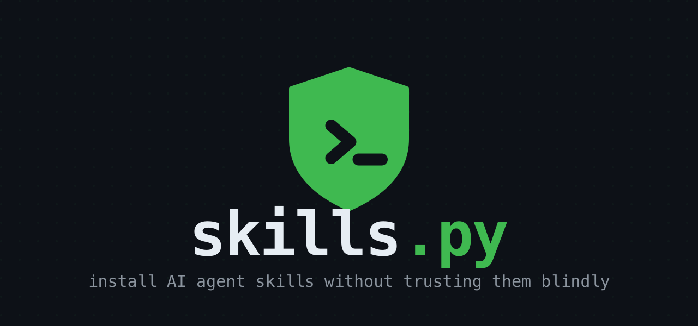
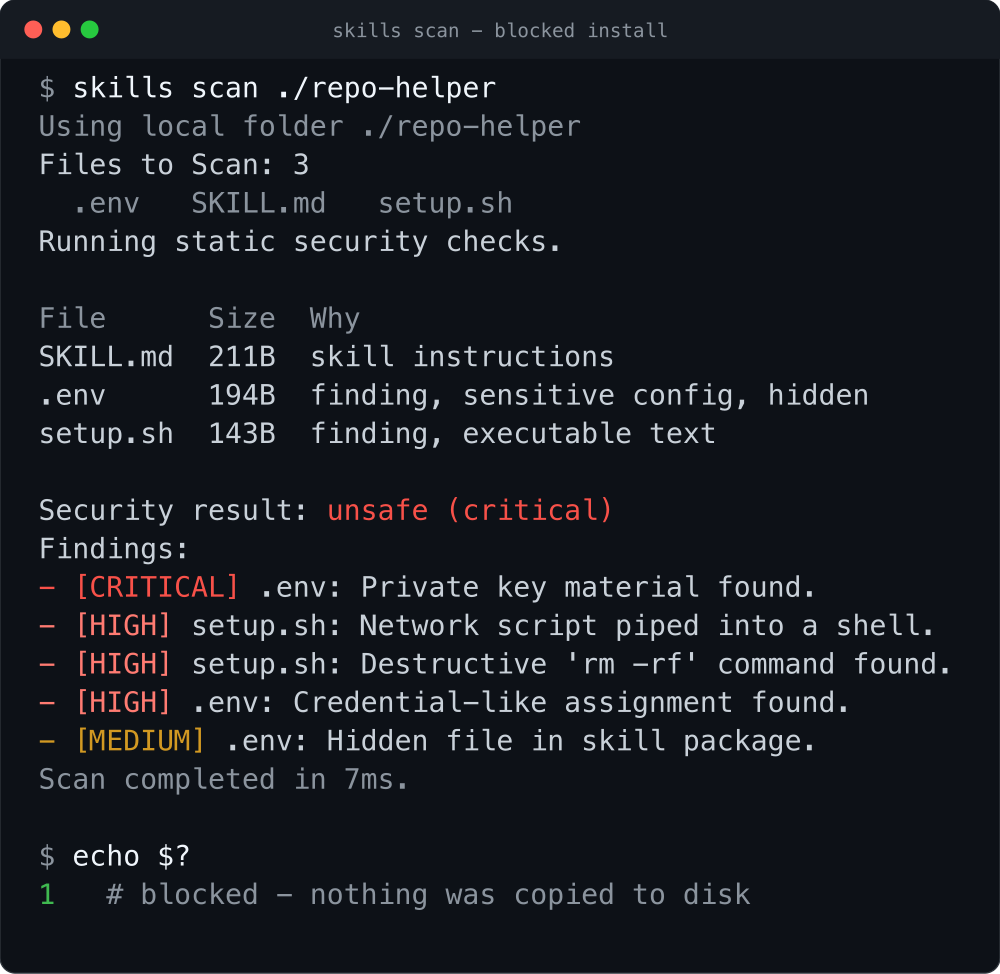
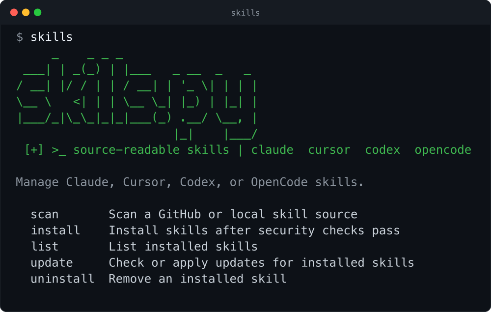

<p align="center">
  
</p>

<p align="center">
  <em>Install AI agent skills without trusting them blindly.</em>
</p>

<p align="center">
  <a href="https://pypi.org/project/skills-package-manager/"></a>
  
  
  
  
</p>

---

`skills.py` installs and manages [agent skills](https://docs.anthropic.com/en/docs/claude-code/skills) for **Claude, Cursor, Codex, and OpenCode**. Before any skill touches your config, it scans the source.

I built it because installing a skill is riskier than it looks. A skill is a folder of Markdown and scripts that your coding agent reads and runs. Install one from someone else's repo and you're running their instructions inside your agent, with your files and your shell. That's a supply-chain problem, so `skills.py` treats it like one: scan the source first, block the obvious traps, and optionally hand the rest to an AI reviewer before a single file hits disk.

One file. No dependencies. Python standard library only.

## See it catch a bad skill

Here's `skills.py` refusing a skill that ships a private key, a `curl | sh` bootstrap, and an `rm -rf`. The install is blocked and nothing is copied to disk:

<p align="center">
  
</p>

## Why

A skill can hide a lot in plain sight: a private key, a `curl | sh` one-liner, a git hook that reinstalls itself after you delete it, a binary blob a text scanner skips, or instructions buried behind padding or opaque files. Once that folder is in `~/.claude/skills/`, your agent reads it and acts on it like any other instruction.

`skills.py` puts a checkpoint in front of the copy step:

- Static checks run on every command and block high and critical findings. No flag to remember.
- AI checks are opt-in (`--ai-checks`). A sandboxed agent reviews the source on its own and writes a JSON verdict.
- Skills have to be source-readable text. If a package ships binaries, archives, native libraries, bytecode, symlinks, or hard links, `skills.py` rejects it.

## Install

Install from PyPI with pip. You get a `skills` command on your `PATH`:

```bash
pip install skills-package-manager
skills --help
```

Prefer an isolated install? Use [pipx](https://pipx.pypa.io/):

```bash
pipx install skills-package-manager
```

Or skip the install. It's one file with no dependencies, so you can run it straight from source:

```bash
curl -O https://raw.githubusercontent.com/mazen160/skills.py/main/skills.py
python3 skills.py --help
```

> The package is published as `skills-package-manager`. Installing it gives you two equivalent commands, `skills` and `skills.py`. If you're running from source instead, use `python3 skills.py`.

Run `skills` with no arguments for the full command surface:

<p align="center">
  
</p>

## Quickstart

```bash
# Scan a skill source without installing anything
skills scan https://github.com/owner/repo

# Scan, then run a second-round AI review with Claude
skills scan https://github.com/owner/repo --ai-checks

# Install into Claude (default) after checks pass
skills install https://github.com/owner/repo

# Install into Cursor instead
skills install https://github.com/owner/repo --agent cursor

# Install one skill from a subfolder of a monorepo
skills install https://github.com/owner/repo/tree/main/skills/my-skill

# Install every skill under a root (recursive SKILL.md discovery)
skills install https://github.com/owner/repo --recursive

# See what's installed across all agents
skills list

# Show descriptions and install paths
skills list --verbose

# Check tracked skills for upstream changes, then apply them
skills update
skills update --apply

# Remove a skill (dry-run first; -y to actually delete)
skills uninstall my-skill
skills uninstall my-skill -y
```

`skills scan` prints the full file list before scanning, then a compact relevant-files table after static checks, including `SKILL.md`, executable scripts, dependency manifests, hidden files, symlinks, archives, compiled payloads, and files with deterministic findings.

## What it checks

The static pass walks the whole source tree and focuses on deterministic supply-chain techniques rather than trying to guess intent from prose:

| Category | Examples |
| --- | --- |
| Secrets & keys | `BEGIN PRIVATE KEY`, `id_rsa`, `.pem`/`.key`, `api_key = "…"` |
| Execution surfaces | `curl … \| sh`, `rm -rf /`, `chmod +x`, `eval`/`exec`, `subprocess`, `os.system` |
| Non-text payloads | binaries, images, archives, Office docs, `.pyc`, `.so`/`.dll`, `.jar`, `.node` |
| Archive indirection | path traversal inside archives, embedded bytecode/native files, embedded scripts, hidden config files |
| Filesystem tricks | symlinks, absolute/escaping links, hard links, hard links that point outside the scanned tree, embedded `.git` metadata, hidden files |
| Persistence | `.git/hooks`, `core.hooksPath`, `.husky`, package lifecycle scripts |
| Registry hijacks | `.npmrc`/`.yarnrc` rewrites, `PIP_INDEX_URL`, extra index URLs |
| Native loading | `LD_PRELOAD`, `DYLD_INSERT_LIBRARIES`, `ctypes.CDLL`, `dlopen`, runtime `.so` compilation |
| Scanner evasion | long whitespace padding, more than 2,000 lines, more than 140,000 chars, files too large to fully scan |
| Credential harvesting surface | executable code that reads environment variables |

High and critical findings block the install. The verdict is printed by default; pass `--security-result-file PATH` when you want to save the normalized JSON report.

The static pass does not try to detect prompt injection by matching phrases like "ignore previous instructions" or "exfiltrate tokens." Those checks are too easy to bypass and too noisy to trust. The AI pass (`--ai-checks`) hands the inventory and source to the agent CLI you pick (`--agent claude|cursor|codex|opencode`). It runs in a restricted sandbox, reviews the source on its own, and merges its findings with the static ones. Normal output hides the large prompt and inventory; use `--show-ai-inputs` when you need to debug the exact AI-review inputs.

## Sources

`skills.py` installs from:

- a GitHub repo URL: `https://github.com/owner/repo`
- a GitHub tree URL: `https://github.com/owner/repo/tree/<branch>/<path>`
- an SSH remote: `git@github.com:owner/repo.git`
- a local folder: `./path/to/skill`

Use `--path` to pick a subfolder and `--branch` to target a branch or tag. GitHub sources are fetched with a sparse, blobless clone when a path is given.

## Where skills are installed

| Agent | Default location | Override |
| --- | --- | --- |
| Claude | `~/.claude/skills` | `CLAUDE_SKILLS_DIR` |
| Codex | `~/.codex/skills` | `CODEX_SKILLS_DIR` |
| Cursor | `~/.cursor/skills-cursor` (or `~/.cursor/skills`) | `CURSOR_SKILLS_DIR` |
| OpenCode | `~/.opencode/skills` | `OPENCODE_SKILLS_DIR` |

Installed skills carry a small `.skills-install.json` record of where they came from, which is what makes `skills update` able to re-fetch and diff them later.

## How it works

1. Resolve and fetch the source into a temporary directory (a sparse clone for GitHub, a direct read for local folders).
2. Gate it. Static checks run every time; the AI review runs when `--ai-checks` is set. Anything high or critical stops here.
3. Copy each `SKILL.md` directory into the target agent's skills folder atomically, with tracking metadata for later updates.

## Requirements

- Python 3.9+
- `git` on your `PATH` (for GitHub sources)
- For `--ai-checks`: the chosen agent's CLI on your `PATH` (`claude`, `cursor`, `codex`, or `opencode`)

## License

MIT © Mazin Ahmed
