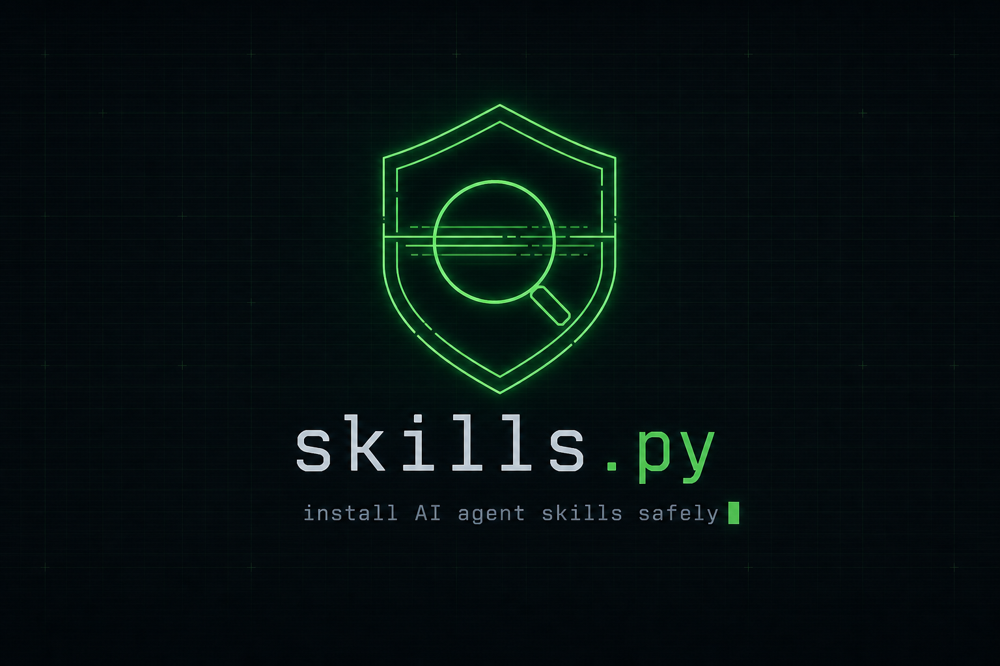

<p align="center">
  
</p>

<p align="center">
  <em>Scan, install, and update AI agent skills — without trusting them blindly.</em>
</p>

<p align="center">
  
  
  
  
</p>

---

`skills.py` is a single-file CLI that manages [agent skills](https://docs.anthropic.com/en/docs/claude-code/skills) for **Claude, Cursor, Codex, and OpenCode** — and runs a security gate over every skill *before* it ever lands in your agent's config.

Agent skills are just folders of Markdown and scripts that your coding agent reads and executes. Installing one from a stranger's repo is running their instructions inside your agent. `skills.py` treats that like the supply-chain problem it is: it scans the source first, blocks the obvious traps, and can hand the rest to an AI reviewer before anything is copied to disk.

No dependencies. One file. Python standard library only.

## Why

A skill can hide a lot in plain sight: a private key, a `curl | sh`, a git hook that re-installs itself, a binary blob a text scanner skims past, or a line of prompt injection buried in `SKILL.md`. Once it's in `~/.claude/skills/`, your agent will happily read and act on it.

`skills.py` puts a checkpoint in front of the copy step:

- **Static checks always run** and block on high/critical findings — no flag required.
- **AI checks are opt-in** (`--ai-checks`): a sandboxed agent independently reviews the source and returns a JSON verdict.
- **Skills must be source-readable text.** Binaries, archives, native libraries, bytecode, symlinks, and hard links are rejected, not silently trusted.

## Install

Recommended — install the `skills` command with [pipx](https://pipx.pypa.io/):

```bash
pipx install git+https://github.com/mazen160/skills.py
```

Or grab the single file and run it directly — there's nothing to build and nothing to pull in:

```bash
curl -O https://raw.githubusercontent.com/mazen160/skills.py/main/skills.py
python3 skills.py --help
```

> Examples below use the `skills` command. If you're running the file directly, swap in `python3 skills.py`.

## Quickstart

```bash
# Scan a skill source without installing anything
skills scan https://github.com/owner/repo

# Scan, then run a second-round AI review with Claude
skills scan https://github.com/owner/repo --ai-checks

# Install into Claude (default) after checks pass
skills install https://github.com/owner/repo

# Install into Cursor instead
skills install https://github.com/owner/repo --agent cursor

# Install one skill from a subfolder of a monorepo
skills install https://github.com/owner/repo/tree/main/skills/my-skill

# Install every skill under a root (recursive SKILL.md discovery)
skills install https://github.com/owner/repo --recursive

# See what's installed across all agents
skills list

# Check tracked skills for upstream changes, then apply them
skills update
skills update --apply

# Remove a skill (dry-run first; -y to actually delete)
skills uninstall my-skill
skills uninstall my-skill -y
```

## What it checks

The static pass walks the whole source tree and flags, among other things:

| Category | Examples |
| --- | --- |
| Secrets & keys | `BEGIN PRIVATE KEY`, `id_rsa`, `.pem`/`.key`, `api_key = "…"` |
| Dangerous commands | `curl … \| sh`, `rm -rf /`, `chmod +x`, `eval`/`exec`, `subprocess` |
| Non-text payloads | binaries, images, archives, `.pyc`, `.so`/`.dll`, Office docs |
| Filesystem tricks | symlinks, absolute/escaping links, hard links, hidden files |
| Persistence | `.git/hooks`, `core.hooksPath`, `.husky`, package lifecycle scripts |
| Registry hijacks | `.npmrc`/`.yarnrc` rewrites, `PIP_INDEX_URL`, extra index URLs |
| Prompt injection | "ignore previous instructions", exfiltration phrasing, scanner-evasion padding |

High and critical findings block the install. Every run writes a normalized JSON report (`skills-security-result.json` by default) so you can read or store the verdict.

The optional AI pass (`--ai-checks`) hands the inventory and source to the agent CLI you choose (`--agent claude|cursor|codex|opencode`) running in a restricted, read-only-ish sandbox, and merges its findings with the deterministic ones.

## Sources

`skills.py` installs from:

- a GitHub repo URL — `https://github.com/owner/repo`
- a GitHub tree URL — `https://github.com/owner/repo/tree/<branch>/<path>`
- an SSH remote — `git@github.com:owner/repo.git`
- a local folder — `./path/to/skill`

Use `--path` to pick a subfolder and `--branch` to target a branch or tag. GitHub sources are fetched with a sparse, blobless clone when a path is given.

## Where skills are installed

| Agent | Default location | Override |
| --- | --- | --- |
| Claude | `~/.claude/skills` | `CLAUDE_SKILLS_DIR` |
| Codex | `~/.codex/skills` | `CODEX_SKILLS_DIR` |
| Cursor | `~/.cursor/skills-cursor` (or `~/.cursor/skills`) | `CURSOR_SKILLS_DIR` |
| OpenCode | `~/.opencode/skills` | `OPENCODE_SKILLS_DIR` |

Installed skills carry a small `.skills-install.json` record of where they came from, which is what makes `skills update` able to re-fetch and diff them later.

## How it works

1. **Resolve & fetch** the source into a temporary directory (sparse clone for GitHub, direct read for local folders).
2. **Gate** it: static checks always; AI review when `--ai-checks` is set. Anything high/critical stops here.
3. **Install** by atomically copying each `SKILL.md` directory into the target agent's skills folder, with tracking metadata for future updates.

## Requirements

- Python 3.9+
- `git` on your `PATH` (for GitHub sources)
- For `--ai-checks`: the chosen agent's CLI on your `PATH` (`claude`, `cursor`, `codex`, or `opencode`)

## License

MIT © Mazin Ahmed
